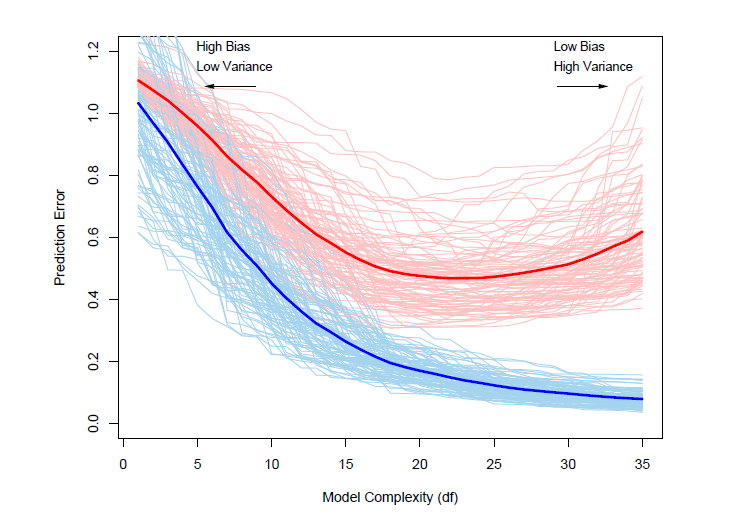
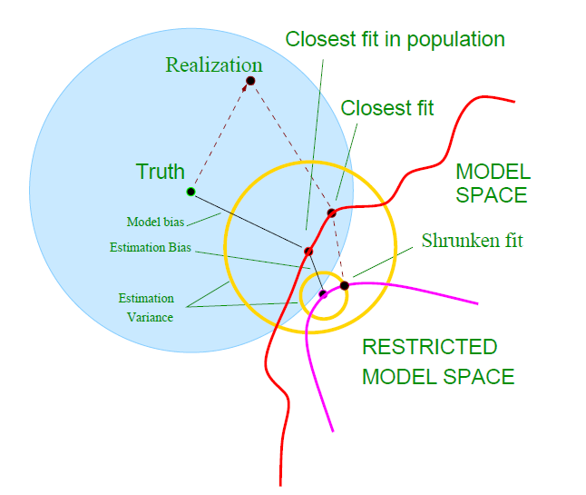
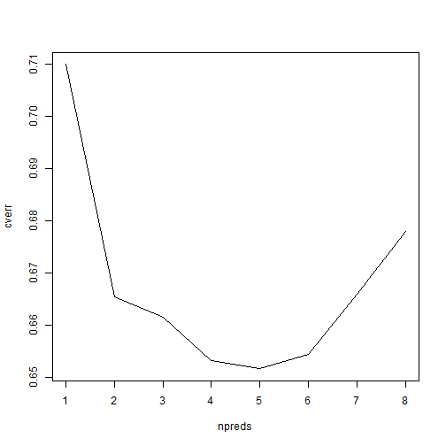

Model Selection
========================================================
author: Daniel Marlay
date: 28 July 2016
width: 1368
height: 768


Why Model Selection
===================

 - Improved business outcomes
 - Get your model implemented
 - Avoid overfitting
 
 
 ----------- ------- --------------- -------------------------
   First    row                12.0 Example of a row that
                                    spans multiple lines.

  Second    row                 5.0 Here's another one. Note
                                    the blank line between
                                    rows.
----------- ------- --------------- -------------------------
 
 
Dimensions that Influence Selection
===================================

Dimension        |  Details
-----------------|-------------------------
Goodness of Fit  | How well the model is able to represent the patterns that are present in the data. Also concerned with avoiding overfitting.
Interpretability | The extent to which the fitted model can be understood by a business user - this may or may not be important in your situation
Implementability | Models aren't useful if you can't use them. The capabilities of your implementation frameworks are important

Goodness of Fit - The Bias-Variance Trade-off
=============================================
 - Bias
   - The extent to which the model prediction differs from the actual value *on average*
   - How well the model form can represent the true functional form of the data
 - Variance
   - The extent to which the model prediction differs from the average model prediction
   - How much does the model vary depending on the specifics of the training data
 - Increasing model complexity usually allows us to decrease bias, at the expense of increasing variance
 - One of the key challenges of model selection is how do we select the right level of complexity
 - There isn't a perfect way to estimate bias or variance during model build

Goodness of Fit - The Bias-Variance Trade-off
=============================================



Source: "Elements of Statistical Learning", T.Hastie, R.Tibshirani, J.Friedman

Goodness of Fit - The Bias-Variance Trade-off
=============================================


Source: "Elements of Statistical Learning", T.Hastie, R.Tibshirani, J.Friedman


Example Models - Prostate Data
==============================

```r
head(prostate);
```

```
      lcavol  lweight age      lbph svi       lcp gleason pgg45       lpsa
1 -0.5798185 2.769459  50 -1.386294   0 -1.386294       6     0 -0.4307829
2 -0.9942523 3.319626  58 -1.386294   0 -1.386294       6     0 -0.1625189
3 -0.5108256 2.691243  74 -1.386294   0 -1.386294       7    20 -0.1625189
4 -1.2039728 3.282789  58 -1.386294   0 -1.386294       6     0 -0.1625189
5  0.7514161 3.432373  62 -1.386294   0 -1.386294       6     0  0.3715636
6 -1.0498221 3.228826  50 -1.386294   0 -1.386294       6     0  0.7654678
  train
1  TRUE
2  TRUE
3  TRUE
4  TRUE
5  TRUE
6  TRUE
```

Example Models - Prostate Data - model1
=======================================

```

Call:
lm(formula = lpsa ~ 1, data = prostate, subset = train)

Residuals:
    Min      1Q  Median      3Q     Max 
-2.8831 -0.7850  0.1164  0.9128  3.0252 

Coefficients:
            Estimate Std. Error t value Pr(>|t|)    
(Intercept)   2.4523     0.1476   16.62   <2e-16 ***
---
Signif. codes:  0 '***' 0.001 '**' 0.01 '*' 0.05 '.' 0.1 ' ' 1

Residual standard error: 1.208 on 66 degrees of freedom
```

Example Models - Prostate Data - model2
=======================================

```

Call:
lm(formula = lpsa ~ lcavol + lweight + age + lbph + svi + lcp + 
    gleason + pgg45, data = prostate, subset = train)

Residuals:
     Min       1Q   Median       3Q      Max 
-1.64870 -0.34147 -0.05424  0.44941  1.48675 

Coefficients:
             Estimate Std. Error t value Pr(>|t|)    
(Intercept)  0.429170   1.553588   0.276  0.78334    
lcavol       0.576543   0.107438   5.366 1.47e-06 ***
lweight      0.614020   0.223216   2.751  0.00792 ** 
age         -0.019001   0.013612  -1.396  0.16806    
lbph         0.144848   0.070457   2.056  0.04431 *  
svi          0.737209   0.298555   2.469  0.01651 *  
lcp         -0.206324   0.110516  -1.867  0.06697 .  
gleason     -0.029503   0.201136  -0.147  0.88389    
pgg45        0.009465   0.005447   1.738  0.08755 .  
---
Signif. codes:  0 '***' 0.001 '**' 0.01 '*' 0.05 '.' 0.1 ' ' 1

Residual standard error: 0.7123 on 58 degrees of freedom
Multiple R-squared:  0.6944,	Adjusted R-squared:  0.6522 
F-statistic: 16.47 on 8 and 58 DF,  p-value: 2.042e-12
```

Example Models - Prostate Data - model3
=======================================

```

Call:
lm(formula = lpsa ~ lcavol + lweight + lbph + svi + lcp + pgg45, 
    data = prostate, subset = train)

Residuals:
     Min       1Q   Median       3Q      Max 
-1.69209 -0.33444 -0.05102  0.53576  1.37947 

Coefficients:
             Estimate Std. Error t value Pr(>|t|)    
(Intercept) -0.728972   0.788328  -0.925   0.3588    
lcavol       0.549778   0.104846   5.244 2.15e-06 ***
lweight      0.563106   0.217436   2.590   0.0120 *  
lbph         0.125979   0.069389   1.816   0.0744 .  
svi          0.756355   0.297239   2.545   0.0135 *  
lcp         -0.190825   0.110076  -1.734   0.0881 .  
pgg45        0.007541   0.004029   1.872   0.0661 .  
---
Signif. codes:  0 '***' 0.001 '**' 0.01 '*' 0.05 '.' 0.1 ' ' 1

Residual standard error: 0.7134 on 60 degrees of freedom
Multiple R-squared:  0.6828,	Adjusted R-squared:  0.6511 
F-statistic: 21.53 on 6 and 60 DF,  p-value: 2.611e-13
```

Goodness of Fit - R^2
====================================
 - R^2 is one of the most commonly used measures for assessing model fit in regressiong models
 - Defined as 1-(Residuals Sum of Squares / Overall Sum of Squares)
 - Interpreted as "percentage of variation explained by the model"

Goodness of Fit - R^2 - model1
====================================

```r
rsq <- function (y,yhat) {return(1 - (sum((y-yhat)^2)/sum((y-mean(y))^2)));}

rsq(prostate$lpsa[prostate$train],
    predict(model1,newdata=prostate[prostate$train,]));
```

```
[1] 0
```

```r
rsq(prostate$lpsa[!prostate$train],
    predict(model1,newdata=prostate[!prostate$train,]));
```

```
[1] -0.006754621
```

Goodness of Fit - R^2 - model2
====================================

```r
rsq(prostate$lpsa[prostate$train],
    predict(model2,newdata=prostate[prostate$train,]));
```

```
[1] 0.6943712
```

```r
rsq(prostate$lpsa[!prostate$train],
    predict(model2,newdata=prostate[!prostate$train,]));
```

```
[1] 0.5033799
```

Goodness of Fit - R^2 - model3
====================================

```r
rsq(prostate$lpsa[prostate$train],
    predict(model3,newdata=prostate[prostate$train,]));
```

```
[1] 0.6828072
```

```r
rsq(prostate$lpsa[!prostate$train],
    predict(model3,newdata=prostate[!prostate$train,]));
```

```
[1] 0.4773526
```


Goodness of Fit - F test
========================

 - Statistical style hypothesis test
 - Null hypothesis:
   - That the more complex model adds no explanatory power over the simpler model
 - By choosing the right pair of models to compare, quite complex model selection tests can be performed


Goodness of Fit - F test
========================

```r
Fstat <- function (y,yhat1,yhat2,p1,p2) {
  n <- length(y);
  RSS1 <- sum((y-yhat1)^2);
  RSS2 <- sum((y-yhat2)^2);
  df1 <- n-p1; df2 <- n-p2;
  Fstat <- ((RSS1-RSS2)/(df1 - df2))/
    (RSS2/df2);
  prob <- 1 - pf(Fstat,df1-df2,df2);
  return(list(Fstat=Fstat,prob=prob));
}
```

Goodness of Fit - F test
========================

```r
Fstat(prostate$lpsa[prostate$train],
      predict(model1,newdata=prostate[prostate$train,]),
      predict(model2,newdata=prostate[prostate$train,]),
      nrow((summary(model1))$coefficients),
      nrow((summary(model2))$coefficients))
```

```
$Fstat
[1] 16.47158

$prob
[1] 2.042366e-12
```


Goodness of Fit - F test
========================

```r
Fstat(prostate$lpsa[prostate$train],
      predict(model3,newdata=prostate[prostate$train,]),
      predict(model2,newdata=prostate[prostate$train,]),
      nrow((summary(model3))$coefficients),
      nrow((summary(model2))$coefficients))
```

```
$Fstat
[1] 1.097261

$prob
[1] 0.3406119
```

Goodness of Fit - AIC and BIC
=============================
 - Motivated by the idea of incorporating a penalty for additional parameters
 - AIC = -2*log-likelihood + 2*npar
 - BIC = -2*log-likelihood + log(n)*npar


```r
AIC(model1);
```

```
[1] 218.4308
```

```r
AIC(model2);
```

```
[1] 155.0101
```

```r
AIC(model3);
```

```
[1] 153.4984
```

Goodness of Fit - Test, Train and Validate
==========================================
 - An older "data mining" approach
 - Used to build a sequence of models, select the best one, then estimate performance
 - Three data sets used
   - Training Set - use this to fit each model
   - Validation Set - use this to choose between the models
   - Test Set - use this **once only** to measure the final model's performance


Goodness of Fit - Cross-validation
==================================
 Like test/train/validate, but more efficient with data
   - Split data into k folds
   - for each value of the "tuning parameter"
     - for each fold
       - fit a model to the remaining folds
       - calculate the error on the held out fold
     - Calculate the average error across all held out folds
   - select the value of the tuning parameter that minimises the error
   - fit a model to the entire data set using the selected tuning parameter value


Goodness of Fit - Cross-validation
==================================

```r
preds <- colnames(prostate[,1:8]);

cvresult <- data.frame(npreds = integer(0),
                       fold = integer(0),
                       cverr = numeric(0));

nfolds <- 30;
folds <- sample.int(nfolds,nrow(prostate),replace=TRUE);
```

Goodness of Fit - Cross-validation
==================================

```r
for (i in 1:length(preds)) {
  for (j in 1:nfolds) {
    test <- prostate[folds == j,];
    train <- prostate[folds != j,];
    
    pcor <- cor(train[,9],train[,1:8]);
    opreds <- preds[order(-abs(pcor))];
    
    mdl <- lm(paste("lpsa ~ ",
                    paste(opreds[1:i],collapse=" + "),sep=""),
              data=train);
    test.preds <- predict(mdl,newdata=test);
    err <- sqrt(mean((test.preds-test$lpsa)^2));
    
    cvresult <- rbind(cvresult,
                      data.frame(npreds = i,fold = j,cverr = err))
    }
  }
```

Goodness of Fit - Cross-validation
==================================

```r
cvresult;
```

```
    npreds fold      cverr
1        1    1 0.34562032
2        1    2 0.40161421
3        1    3 0.52683892
4        1    4 0.49662389
5        1    5 0.08046642
6        1    6 0.18135329
7        1    7 1.31817555
8        1    8 0.96210305
9        1    9 0.94623368
10       1   10 0.97050437
11       1   11 0.49364470
12       1   12        NaN
13       1   13 0.62995192
14       1   14 0.49084612
15       1   15        NaN
16       1   16 0.88462214
17       1   17 0.61608240
18       1   18 0.81222937
19       1   19 0.89276334
20       1   20 1.02779965
21       1   21 0.39294149
22       1   22 0.71201804
23       1   23 0.93187395
24       1   24 0.86698594
25       1   25        NaN
26       1   26 0.23300331
27       1   27 1.01423499
28       1   28 1.26158552
29       1   29 1.20986207
30       1   30 0.97237527
31       2    1 0.38858246
32       2    2 0.54424887
33       2    3 0.43003476
34       2    4 0.63180423
35       2    5 0.33530629
36       2    6 0.43541815
37       2    7 1.15445544
38       2    8 0.89305282
39       2    9 0.95963879
40       2   10 0.51103714
41       2   11 0.40391998
42       2   12        NaN
43       2   13 0.78967665
44       2   14 0.50642314
45       2   15        NaN
46       2   16 0.82415639
47       2   17 0.58367022
48       2   18 0.79245281
49       2   19 0.84960046
50       2   20 0.89321947
51       2   21 0.35739180
52       2   22 0.89762087
53       2   23 0.91109895
54       2   24 0.96622760
55       2   25        NaN
56       2   26 0.35629259
57       2   27 0.70547899
58       2   28 1.09496417
59       2   29 1.19181495
60       2   30 0.80778611
61       3    1 0.37130856
62       3    2 0.53974697
63       3    3 0.46732226
64       3    4 0.61974508
65       3    5 0.31261113
66       3    6 0.39147236
67       3    7 1.19121922
68       3    8 0.89654404
69       3    9 0.96587328
70       3   10 0.47606456
71       3   11 0.40464273
72       3   12        NaN
73       3   13 0.79538493
74       3   14 0.49210819
75       3   15        NaN
76       3   16 0.82250810
77       3   17 0.58276922
78       3   18 0.79520824
79       3   19 0.86848759
80       3   20 0.88756192
81       3   21 0.38347697
82       3   22 0.88961834
83       3   23 0.92094069
84       3   24 0.95383184
85       3   25        NaN
86       3   26 0.33735848
87       3   27 0.69507617
88       3   28 1.11176998
89       3   29 1.18791517
90       3   30 0.80136160
91       4    1 0.37072627
92       4    2 0.64800124
93       4    3 0.36381951
94       4    4 0.59084320
95       4    5 0.42949930
96       4    6 0.42798899
97       4    7 1.20033899
98       4    8 0.99627702
99       4    9 0.96419913
100      4   10 0.70678809
101      4   11 0.35381371
102      4   12        NaN
103      4   13 0.86954510
104      4   14 0.48178247
105      4   15        NaN
106      4   16 0.91798187
107      4   17 0.48689331
108      4   18 0.70229487
109      4   19 0.84322667
110      4   20 0.77749169
111      4   21 0.50207051
112      4   22 0.97905461
113      4   23 0.83788840
114      4   24 0.60994851
115      4   25        NaN
116      4   26 0.75254530
117      4   27 0.63773872
118      4   28 1.03238183
119      4   29 0.80201364
120      4   30 0.61593595
121      5    1 0.37563218
122      5    2 0.66755533
123      5    3 0.32696670
124      5    4 0.56600433
125      5    5 0.43138348
126      5    6 0.32739397
127      5    7 0.81567631
128      5    8 1.13220559
129      5    9 0.79280543
130      5   10 0.72196667
131      5   11 0.40811144
132      5   12        NaN
133      5   13 0.91789635
134      5   14 0.44467366
135      5   15        NaN
136      5   16 0.88190458
137      5   17 0.45418428
138      5   18 0.65677462
139      5   19 0.79163078
140      5   20 0.70343383
141      5   21 0.67464609
142      5   22 0.95569297
143      5   23 0.81240120
144      5   24 0.63322126
145      5   25        NaN
146      5   26 0.74883896
147      5   27 0.54601769
148      5   28 1.03261463
149      5   29 0.80137108
150      5   30 0.57351967
151      6    1 0.37073168
152      6    2 0.67393448
153      6    3 0.32017474
154      6    4 0.56358923
155      6    5 0.42697104
156      6    6 0.35119792
157      6    7 0.81214882
158      6    8 1.13253692
159      6    9 0.79499892
160      6   10 0.71603612
161      6   11 0.41968926
162      6   12        NaN
163      6   13 0.95779963
164      6   14 0.44216613
165      6   15        NaN
166      6   16 0.88084697
167      6   17 0.50210793
168      6   18 0.65406816
169      6   19 0.79605841
170      6   20 0.72007279
171      6   21 0.67790308
172      6   22 0.95927016
173      6   23 0.80916929
174      6   24 0.63646743
175      6   25        NaN
176      6   26 0.74951964
177      6   27 0.57089835
178      6   28 1.06763001
179      6   29 0.79986133
180      6   30 0.57742100
181      7    1 0.27046340
182      7    2 0.78114072
183      7    3 0.25744511
184      7    4 0.50332196
185      7    5 0.53197786
186      7    6 0.51064042
187      7    7 0.75719693
188      7    8 1.09365278
189      7    9 0.74288909
190      7   10 0.76434835
191      7   11 0.37291603
192      7   12        NaN
193      7   13 0.90365352
194      7   14 0.40054091
195      7   15        NaN
196      7   16 0.89173780
197      7   17 0.51253261
198      7   18 0.71476377
199      7   19 0.77459949
200      7   20 0.73088186
201      7   21 0.58095867
202      7   22 0.92074562
203      7   23 0.85890997
204      7   24 0.60033217
205      7   25        NaN
206      7   26 0.71974711
207      7   27 0.50666505
208      7   28 1.04276008
209      7   29 1.03313853
210      7   30 0.54949051
211      8    1 0.24544375
212      8    2 0.88517900
213      8    3 0.30283099
214      8    4 0.51359569
215      8    5 0.59135955
216      8    6 0.50538905
217      8    7 0.68627747
218      8    8 1.06896939
219      8    9 0.70926098
220      8   10 0.75898399
221      8   11 0.33451733
222      8   12        NaN
223      8   13 0.89619561
224      8   14 0.52652490
225      8   15        NaN
226      8   16 0.83231385
227      8   17 0.63237764
228      8   18 0.77778388
229      8   19 0.73215056
230      8   20 0.75992256
231      8   21 0.57041446
232      8   22 0.93483960
233      8   23 0.84382806
234      8   24 0.47753439
235      8   25        NaN
236      8   26 0.81433182
237      8   27 0.65926813
238      8   28 1.02625378
239      8   29 1.15375503
240      8   30 0.53649092
```

Goodness of Fit - Cross-validation
==================================

```r
plot(cverr ~ npreds,
     data=aggregate(cverr ~ npreds,data=cvresult,mean),
     type="l");
```

 

Goodness of Fit - Cross-validation
==================================

```r
boxplot(cverr ~ npreds,data=cvresult);
```

 

Goodness of Fit - Cross-validation
==================================

```r
model4 <- lm(paste("lpsa ~ ",
                    paste(preds[1:5],collapse=" + "),sep=""),
              data=prostate[prostate$train,]);
summary(model4);
```

```

Call:
lm(formula = paste("lpsa ~ ", paste(preds[1:5], collapse = " + "), 
    sep = ""), data = prostate[prostate$train, ])

Residuals:
    Min      1Q  Median      3Q     Max 
-1.8841 -0.3956 -0.0115  0.4849  1.4142 

Coefficients:
            Estimate Std. Error t value Pr(>|t|)    
(Intercept)  0.37976    1.05124   0.361   0.7192    
lcavol       0.52382    0.09435   5.552 6.52e-07 ***
lweight      0.57221    0.22321   2.564   0.0128 *  
age         -0.01315    0.01313  -1.001   0.3207    
lbph         0.15356    0.07170   2.142   0.0362 *  
svi          0.66973    0.27323   2.451   0.0171 *  
---
Signif. codes:  0 '***' 0.001 '**' 0.01 '*' 0.05 '.' 0.1 ' ' 1

Residual standard error: 0.7275 on 61 degrees of freedom
Multiple R-squared:  0.6647,	Adjusted R-squared:  0.6372 
F-statistic: 24.18 on 5 and 61 DF,  p-value: 2.509e-13
```

Goodness of Fit - Cross-validation
==================================

```r
sqrt(mean((predict(model4,newdata=prostate[!prostate$train,])-
             prostate$lpsa[!prostate$train])^2))
```

```
[1] 0.6574194
```


Goodness of Fit - Doing Cross-validation Wrong
==============================================
 - No part of the model process should be done outside of the cross-validation loop
 - If you don't do this, you get information leakage
 - See http://www.alfredo.motta.name/cross-validation-done-wrong/ for the source

***


Goodness of Fit - Loss functions?
=================================================
 - Usually, we aren't interested in pure prediction, but more about the business impact
 - Loss functions relate the difference between an actual and predicted outcome to some measure of loss
   - Root mean square error is a common example that we have seen already today
 - Cross-validation, train/test/validate, etc can be run with different loss functions
 - Using a loss function that incorporates the actual benefit/costs of correct/incorrect predictions in your business helps to pick a model that is business optimal

Goodness of Fit - Can we really assess it at all?
=================================================

 - Past Performance is Not Necessarily Indicative of Future Results
 - All of our techniques rely on past data
 - We must always remember that the situation could change
 - Actuaries would use a "Control Cycle"


Interpretability - Structure
============================
 - Type B data scientists think this is rubbish!
 - But often, you need to convince a business person
 - Some models are more suited to this:
   - Linear regressions and their variants
   - Decision trees


Interpretability - Dealing with a Black Box
===========================================
 - If your preferred model is a "black box", all is not lost
   - SVM
   - Neural networks
   - Anything that involves ensembles, bagging, boosting, etc
 - Smart graphics can help reveal the structure:
   - variable importance plots (randomForest, gbms)
   - partial correlation plots
   - standard regression diagnostics


Interpretability - Standardised Formats
=======================================
 - Some disciplines have standardised formats for expressing models:
   - Credit scorecards
 - Get to know what has been used before

Implementation - Technology Stack
=================================
 - The range of models that can be implemented can be determined by the technology available
 - Often you can't change this quickly
 - Sometimes (if you are crafty) you can figure out ways to translate models into the technology available


Implementation - Team Capability
================================
 - Not everyone in a team is a data science star
 - Remember that if you are the only person who knows how to run it and fix it, it could be you who ends up having to stay back on a Saturday night...


Implementation - Monitoring and Refresh
=======================================
 - Models don't stay static
 - Need to consider implementing some form of monitoring
 - As usual, if this can be automated then it is better


Further reading
===============
 - Type A and B data scientists - https://medium.com/@rchang/my-two-year-journey-as-a-data-scientist-at-twitter-f0c13298aee6
 - Elements of Statistical Learning - Chapter 7 covers model selection in great detail - http://statweb.stanford.edu/~tibs/ElemStatLearn/
 - Practical Regression and Anova in R - Covers the F tests and more traditional model selection in good detail - http://www.maths.bath.ac.uk/~jjf23/book/
 - Cross-validation done wrong - http://www.alfredo.motta.name/cross-validation-done-wrong/
 
