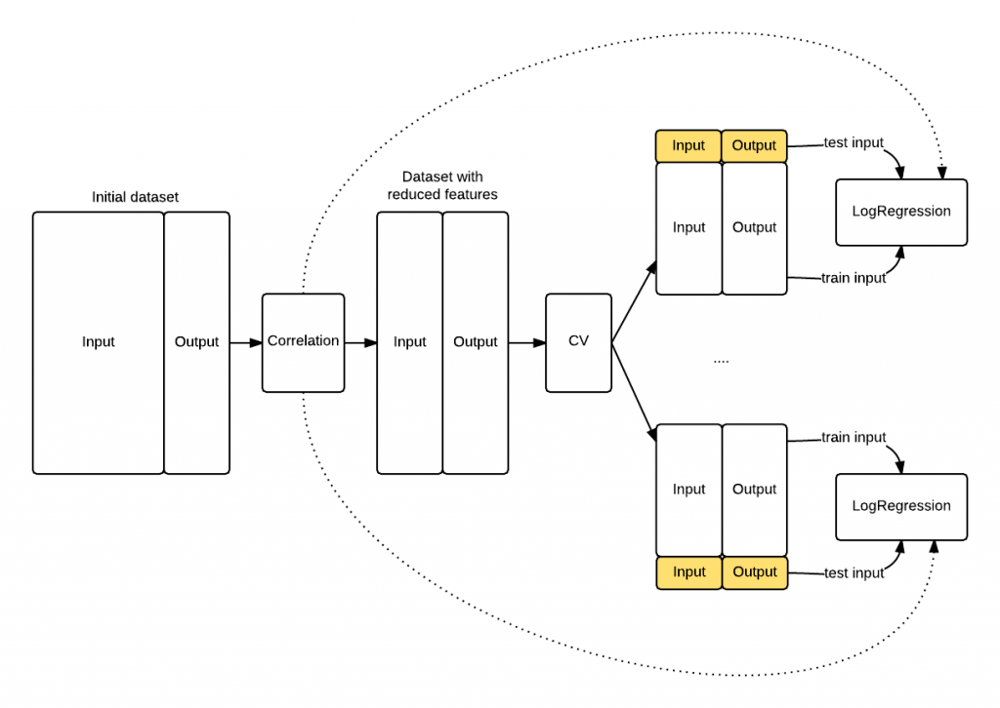

Model Selection
========================================================
author: Daniel Marlay
date: 20 October 2015
width: 1368
height: 768


Why Model Selection
===================

 - Improved business outcomes
 - Get your model implemented
 - Avoid overfitting
 
 
Dimensions that Influence Selection
===================================

Dimension        |  Details
-----------------|-------------------------
Goodness of Fit  | How well the model is able to represent the patterns that are present in the data. Also concerned with avoiding overfitting.
Interpretability | The extent to which the fitted model can be understood by a business user - this may or may not be important in your situation
Implementability | Models aren't useful if you can't use them. The capabilities of your implementation frameworks are important

Goodness of Fit - The Bias-Variance Trade-off
=============================================
 - Bias
   - The extent to which the model prediction differs from the actual value *on average*
   - How well the model form can represent the true functional form of the data
 - Variance
   - The extent to which the model prediction differs from the average model prediction
   - How much does the model vary depending on the specifics of the training data
 - Increasing model complexity usually allows us to decrease bias, at the expense of increasing variance
 - One of the key challenges of model selection is how do we select the right level of complexity
 - There isn't a perfect way to estimate bias or variance during model build

Goodness of Fit - The Bias-Variance Trade-off
=============================================


Source: "Elements of Statistical Learning", T.Hastie, R.Tibshirani, J.Friedman

Goodness of Fit - The Bias-Variance Trade-off
=============================================


Source: "Elements of Statistical Learning", T.Hastie, R.Tibshirani, J.Friedman


Example Models - Prostate Data
==============================

```r
head(prostate);
```

```
      lcavol  lweight age      lbph svi       lcp gleason pgg45       lpsa
1 -0.5798185 2.769459  50 -1.386294   0 -1.386294       6     0 -0.4307829
2 -0.9942523 3.319626  58 -1.386294   0 -1.386294       6     0 -0.1625189
3 -0.5108256 2.691243  74 -1.386294   0 -1.386294       7    20 -0.1625189
4 -1.2039728 3.282789  58 -1.386294   0 -1.386294       6     0 -0.1625189
5  0.7514161 3.432373  62 -1.386294   0 -1.386294       6     0  0.3715636
6 -1.0498221 3.228826  50 -1.386294   0 -1.386294       6     0  0.7654678
  train
1  TRUE
2  TRUE
3  TRUE
4  TRUE
5  TRUE
6  TRUE
```

Example Models - Prostate Data - model1
=======================================

```

Call:
lm(formula = lpsa ~ 1, data = prostate, subset = train)

Residuals:
    Min      1Q  Median      3Q     Max 
-2.8831 -0.7850  0.1164  0.9128  3.0252 

Coefficients:
            Estimate Std. Error t value Pr(>|t|)    
(Intercept)   2.4523     0.1476   16.62   <2e-16 ***
---
Signif. codes:  0 '***' 0.001 '**' 0.01 '*' 0.05 '.' 0.1 ' ' 1

Residual standard error: 1.208 on 66 degrees of freedom
```

Example Models - Prostate Data - model2
=======================================

```

Call:
lm(formula = lpsa ~ lcavol + lweight + age + lbph + svi + lcp + 
    gleason + pgg45, data = prostate, subset = train)

Residuals:
     Min       1Q   Median       3Q      Max 
-1.64870 -0.34147 -0.05424  0.44941  1.48675 

Coefficients:
             Estimate Std. Error t value Pr(>|t|)    
(Intercept)  0.429170   1.553588   0.276  0.78334    
lcavol       0.576543   0.107438   5.366 1.47e-06 ***
lweight      0.614020   0.223216   2.751  0.00792 ** 
age         -0.019001   0.013612  -1.396  0.16806    
lbph         0.144848   0.070457   2.056  0.04431 *  
svi          0.737209   0.298555   2.469  0.01651 *  
lcp         -0.206324   0.110516  -1.867  0.06697 .  
gleason     -0.029503   0.201136  -0.147  0.88389    
pgg45        0.009465   0.005447   1.738  0.08755 .  
---
Signif. codes:  0 '***' 0.001 '**' 0.01 '*' 0.05 '.' 0.1 ' ' 1

Residual standard error: 0.7123 on 58 degrees of freedom
Multiple R-squared:  0.6944,	Adjusted R-squared:  0.6522 
F-statistic: 16.47 on 8 and 58 DF,  p-value: 2.042e-12
```

Example Models - Prostate Data - model3
=======================================

```

Call:
lm(formula = lpsa ~ lcavol + lweight + lbph + svi + lcp + pgg45, 
    data = prostate, subset = train)

Residuals:
     Min       1Q   Median       3Q      Max 
-1.69209 -0.33444 -0.05102  0.53576  1.37947 

Coefficients:
             Estimate Std. Error t value Pr(>|t|)    
(Intercept) -0.728972   0.788328  -0.925   0.3588    
lcavol       0.549778   0.104846   5.244 2.15e-06 ***
lweight      0.563106   0.217436   2.590   0.0120 *  
lbph         0.125979   0.069389   1.816   0.0744 .  
svi          0.756355   0.297239   2.545   0.0135 *  
lcp         -0.190825   0.110076  -1.734   0.0881 .  
pgg45        0.007541   0.004029   1.872   0.0661 .  
---
Signif. codes:  0 '***' 0.001 '**' 0.01 '*' 0.05 '.' 0.1 ' ' 1

Residual standard error: 0.7134 on 60 degrees of freedom
Multiple R-squared:  0.6828,	Adjusted R-squared:  0.6511 
F-statistic: 21.53 on 6 and 60 DF,  p-value: 2.611e-13
```

Goodness of Fit - R^2
====================================
 - R^2 is one of the most commonly used measures for assessing model fit in regressiong models
 - Defined as 1-(Residuals Sum of Squares / Overall Sum of Squares)
 - Interpreted as "percentage of variation explained by the model"

Goodness of Fit - R^2 - model1
====================================

```r
rsq <- function (y,yhat) {return(1 - (sum((y-yhat)^2)/sum((y-mean(y))^2)));}

rsq(prostate$lpsa[prostate$train],
    predict(model1,newdata=prostate[prostate$train,]));
```

```
[1] 0
```

```r
rsq(prostate$lpsa[!prostate$train],
    predict(model1,newdata=prostate[!prostate$train,]));
```

```
[1] -0.006754621
```

Goodness of Fit - R^2 - model2
====================================

```r
rsq(prostate$lpsa[prostate$train],
    predict(model2,newdata=prostate[prostate$train,]));
```

```
[1] 0.6943712
```

```r
rsq(prostate$lpsa[!prostate$train],
    predict(model2,newdata=prostate[!prostate$train,]));
```

```
[1] 0.5033799
```

Goodness of Fit - R^2 - model3
====================================

```r
rsq(prostate$lpsa[prostate$train],
    predict(model3,newdata=prostate[prostate$train,]));
```

```
[1] 0.6828072
```

```r
rsq(prostate$lpsa[!prostate$train],
    predict(model3,newdata=prostate[!prostate$train,]));
```

```
[1] 0.4773526
```


Goodness of Fit - F test
========================

 - Statistical style hypothesis test
 - Null hypothesis:
   - That the more complex model adds no explanatory power over the simpler model
 - By choosing the right pair of models to compare, quite complex model selection tests can be performed


Goodness of Fit - F test
========================

```r
Fstat <- function (y,yhat1,yhat2,p1,p2) {
  n <- length(y);
  RSS1 <- sum((y-yhat1)^2);
  RSS2 <- sum((y-yhat2)^2);
  df1 <- n-p1; df2 <- n-p2;
  Fstat <- ((RSS1-RSS2)/(df1 - df2))/
    (RSS2/df2);
  prob <- 1 - pf(Fstat,df1-df2,df2);
  return(list(Fstat=Fstat,prob=prob));
}
```

Goodness of Fit - F test
========================

```r
Fstat(prostate$lpsa[prostate$train],
      predict(model1,newdata=prostate[prostate$train,]),
      predict(model2,newdata=prostate[prostate$train,]),
      nrow((summary(model1))$coefficients),
      nrow((summary(model3))$coefficients))
```

```
$Fstat
[1] 22.71943

$prob
[1] 8.848478e-14
```


Goodness of Fit - F test
========================

```r
Fstat(prostate$lpsa[prostate$train],
      predict(model3,newdata=prostate[prostate$train,]),
      predict(model2,newdata=prostate[prostate$train,]),
      nrow((summary(model3))$coefficients),
      nrow((summary(model2))$coefficients))
```

```
$Fstat
[1] 1.097261

$prob
[1] 0.3406119
```

Goodness of Fit - AIC and BIC
=============================
 - Motivated by the idea of incorporating a penalty for additional parameters
 - AIC = -2*log-likelihood + 2*npar
 - BIC = -2*log-likelihood + log(n)*npar


```r
AIC(model1);
```

```
[1] 218.4308
```

```r
AIC(model2);
```

```
[1] 155.0101
```

```r
AIC(model3);
```

```
[1] 153.4984
```

Goodness of Fit - Test, Train and Validate
==========================================
 - An older "data mining" approach
 - Used to build a sequence of models, select the best one, then estimate performance
 - Three data sets used
   - Training Set - use this to fit each model
   - Validation Set - use this to choose between the models
   - Test Set - use this **once only** to measure the final model's performance


Goodness of Fit - Cross-validation
==================================
 Like test/train/validate, but more efficient with data
   - Split data into k folds
   - for each value of the "tuning parameter"
     - for each fold
       - fit a model to the remaining folds
       - calculate the error on the held out fold
     - Calculate the average error across all held out folds
   - select the value of the tuning parameter that minimises the error
   - fit a model to the entire data set using the selected tuning parameter value


Goodness of Fit - Cross-validation
==================================

```r
preds <- colnames(prostate[,1:8]);
pcor <- cor(prostate[,9],prostate[,1:8]);
preds <- preds[order(-abs(pcor))];

cvresult <- data.frame(npreds = 1:8,
                       cverr = rep(0,8),
                       cverrse = rep(0,8));
folds <- sample.int(20,nrow(prostate),replace=TRUE);
```

Goodness of Fit - Cross-validation
==================================

```r
for (i in 1:8) {
  errs <- rep(0,20);
  for (j in 1:20) {
    test <- prostate[folds == j,];
    train <- prostate[folds != j,];
    mdl <- lm(paste("lpsa ~ ",
                    paste(preds[1:i],collapse=" + "),sep=""),
              data=train);
    test.preds <- predict(mdl,newdata=test);
    errs[j] <- sqrt(mean((test.preds-test$lpsa)^2));
  }
  cvresult$cverr[i] <- mean(errs);
  cvresult$cverrse[i] <- sd(errs);
}
```

Goodness of Fit - Cross-validation
==================================

```r
cvresult;
```

```
  npreds     cverr   cverrse
1      1 0.7100045 0.3027529
2      2 0.6654247 0.2635478
3      3 0.6614912 0.2715984
4      4 0.6531965 0.2427368
5      5 0.6516738 0.2421275
6      6 0.6544500 0.2468355
7      7 0.6659222 0.2373207
8      8 0.6779414 0.2182063
```

Goodness of Fit - Cross-validation
==================================

```r
plot(cverr ~ npreds,data=cvresult,type="l");
```

 

Goodness of Fit - Cross-validation
==================================

```r
model4 <- lm(paste("lpsa ~ ",
                    paste(preds[1:5],collapse=" + "),sep=""),
              data=prostate);
summary(model4);
```

```

Call:
lm(formula = paste("lpsa ~ ", paste(preds[1:5], collapse = " + "), 
    sep = ""), data = prostate)

Residuals:
     Min       1Q   Median       3Q      Max 
-1.70046 -0.43499 -0.01321  0.37832  1.70740 

Coefficients:
             Estimate Std. Error t value Pr(>|t|)    
(Intercept) -0.912399   0.633279  -1.441 0.153086    
lcavol       0.541449   0.086428   6.265 1.22e-08 ***
svi          0.692793   0.239459   2.893 0.004772 ** 
lcp         -0.080911   0.089967  -0.899 0.370845    
lweight      0.658881   0.175985   3.744 0.000317 ***
pgg45        0.004277   0.003311   1.292 0.199747    
---
Signif. codes:  0 '***' 0.001 '**' 0.01 '*' 0.05 '.' 0.1 ' ' 1

Residual standard error: 0.7084 on 91 degrees of freedom
Multiple R-squared:  0.643,	Adjusted R-squared:  0.6234 
F-statistic: 32.79 on 5 and 91 DF,  p-value: < 2.2e-16
```


Goodness of Fit - Doing Cross-validation Wrong
==============================================
 - No part of the model process should be done outside of the cross-validation loop
 - If you don't do this, you get information leakage
 - See http://www.alfredo.motta.name/cross-validation-done-wrong/ for the source

***



Goodness of Fit - Loss functions?
=================================================
 - Usually, we aren't interested in pure prediction, but more about the business impact
 - Loss functions relate the difference between an actual and predicted outcome to some measure of loss
   - Root mean square error is a common example that we have seen already today
 - Cross-validation, train/test/validate, etc can be run with different loss functions
 - Using a loss function that incorporates the actual benefit/costs of correct/incorrect predictions in your business helps to pick a model that is business optimal

Goodness of Fit - Can we really assess it at all?
=================================================

 - Past Performance is Not Necessarily Indicative of Future Results
 - All of our techniques rely on past data
 - We must always remember that the situation could change
 - Actuaries would use a "Control Cycle"


Interpretability - Structure
============================
 - Type B data scientists think this is rubbish!
 - But often, you need to convince a business person
 - Some models are more suited to this:
   - Linear regressions and their variants
   - Decision trees


Interpretability - Dealing with a Black Box
===========================================
 - If your preferred model is a "black box", all is not lost
   - SVM
   - Neural networks
   - Anything that involves ensembles, bagging, boosting, etc
 - Smart graphics can help reveal the structure:
   - variable importance plots (randomForest, gbms)
   - partial correlation plots
   - standard regression diagnostics


Interpretability - Standardised Formats
=======================================
 - Some disciplines have standardised formats for expressing models:
   - Credit scorecards
 - Get to know what has been used before

Implementation - Technology Stack
=================================
 - The range of models that can be implemented can be determined by the technology available
 - Often you can't change this quickly
 - Sometimes (if you are crafty) you can figure out ways to translate models into the technology available


Implementation - Team Capability
================================
 - Not everyone in a team is a data science star
 - Remember that if you are the only person who knows how to run it and fix it, it could be you who ends up having to stay back on a Saturday night...


Implementation - Monitoring and Refresh
=======================================
 - Models don't stay static
 - Need to consider implementing some form of monitoring
 - As usual, if this can be automated then it is better


Further reading
===============
 - Type A and B data scientists - https://medium.com/@rchang/my-two-year-journey-as-a-data-scientist-at-twitter-f0c13298aee6
 - Elements of Statistical Learning - Chapter 7 covers model selection in great detail - http://statweb.stanford.edu/~tibs/ElemStatLearn/
 - Practical Regression and Anova in R - Covers the F tests and more traditional model selection in good detail - http://www.maths.bath.ac.uk/~jjf23/book/
 - Cross-validation done wrong - http://www.alfredo.motta.name/cross-validation-done-wrong/
 
