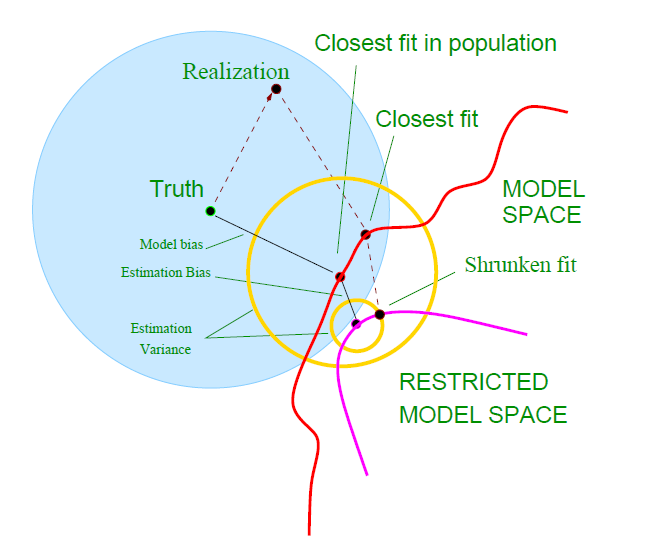

```{r setup, echo=FALSE, results="hide", message=FALSE}
set.seed(20151020);
library(lars);
library(rpart);
prostate <- read.table("Input/prostate.data")

```
# Introduction

## Objectives of model selection

+---------------+----------------------------------------+
| Objective     | Key Questions                          |
+===============+========================================+
| Performance   | - Is our model good enough?            |
|               | - Which model is best?                 |
|               | (algorithm,                            |
|               | features,                              |
|               | tuning parameters)                     |
|               | - How well will it perform?            |
+---------------+----------------------------------------+
| Validity      | - Is our model overfitted to           |
|               |   the data?                            |
|               | - Will the model work when             |
|               |   in production?                       |
+---------------+----------------------------------------+
| Usability     | - Will the business accept             |
|               |   it?                                  |
|               | - Can it be put into                   |
|               |   production?                          |
|               | - Will it last?                        |
+---------------+----------------------------------------+

# Example data and models

## Prostate Data

```{r}
head(prostate);

```

## Model 1 - Null model

```{r echo=FALSE}
model1 <- lm(lpsa ~ 1,data=prostate,subset=train);
summary(model1);

```

## Model 2 - Full model

```{r echo=FALSE}
model2 <- lm(lpsa ~ lcavol + lweight + age + lbph + svi + lcp + gleason + pgg45,data=prostate,subset=train);
summary(model2);

```

## Model 3 - "Just Right" model

```{r echo=FALSE}
model3 <- lm(lpsa ~ lcavol + lweight + lbph + svi + lcp + pgg45,data=prostate,subset=train);
summary(model3);
```


# Performance

## $R^2$

 - $R^2$ is one of the most commonly used measures for assessing model fit in regressiong models
 - Defined as 1-(Residuals Sum of Squares / Overall Sum of Squares)
 - Often interpreted as "percentage of variation explained by the model"
 - Not necessarily the square of the Pearson Correlation

## $R^2$ - Model 1

```{r}
rsq <- function (y,yhat) {return(1 - (sum((y-yhat)^2)/sum((y-mean(y))^2)));}

rsq(prostate$lpsa[prostate$train],
    predict(model1,newdata=prostate[prostate$train,]));

rsq(prostate$lpsa[!prostate$train],
    predict(model1,newdata=prostate[!prostate$train,]));
```

## $R^2$ - Model 2

```{r}
rsq(prostate$lpsa[prostate$train],
    predict(model2,newdata=prostate[prostate$train,]));

(cor(prostate$lpsa[prostate$train],
     predict(model2,newdata=prostate[prostate$train,])))^2

rsq(prostate$lpsa[!prostate$train],
    predict(model2,newdata=prostate[!prostate$train,]));

(cor(prostate$lpsa[!prostate$train],
     predict(model2,newdata=prostate[!prostate$train,])))^2
```

## $R^2$ - Model 3

```{r}
rsq(prostate$lpsa[prostate$train],
    predict(model3,newdata=prostate[prostate$train,]));

rsq(prostate$lpsa[!prostate$train],
    predict(model3,newdata=prostate[!prostate$train,]));

```


## F test

 - Statistical style hypothesis test
 - Null hypothesis:
   - That the more complex model adds no explanatory power over the simpler model
 - By choosing the right pair of models to compare, quite complex model selection tests can be performed


## Calculating the F statistic

```{r}
Fstat <- function (y,yhat1,yhat2,p1,p2) {
  n <- length(y);
  RSS1 <- sum((y-yhat1)^2);
  RSS2 <- sum((y-yhat2)^2);
  df1 <- n-p1; df2 <- n-p2;
  Fstat <- ((RSS1-RSS2)/(df1 - df2))/
    (RSS2/df2);
  prob <- 1 - pf(Fstat,df1-df2,df2);
  return(list(Fstat=Fstat,prob=prob));
}

```

## Comparing model 2 to model 1 with the F test

- Does the full model offer an improvement over the null model?

```{r}
Fstat(prostate$lpsa[prostate$train],
      predict(model1,newdata=prostate[prostate$train,]),
      predict(model2,newdata=prostate[prostate$train,]),
      nrow((summary(model1))$coefficients),
      nrow((summary(model2))$coefficients))
```


## Comparing model 2 to model 3 with the F test

- Does the full model offer an improvement over the "just right" model?

```{r}
Fstat(prostate$lpsa[prostate$train],
      predict(model3,newdata=prostate[prostate$train,]),
      predict(model2,newdata=prostate[prostate$train,]),
      nrow((summary(model3))$coefficients),
      nrow((summary(model2))$coefficients))
```


## Comparing model 3 to model 1 with the F test

- Does the "just right" model offer an improvement over the null model?

```{r}
Fstat(prostate$lpsa[prostate$train],
      predict(model1,newdata=prostate[prostate$train,]),
      predict(model3,newdata=prostate[prostate$train,]),
      nrow((summary(model1))$coefficients),
      nrow((summary(model3))$coefficients))
```

## AIC and BIC

- Motivated by the idea of incorporating a penalty for additional parameters
 - AIC = -2*log-likelihood + 2*npar
 - BIC = -2*log-likelihood + log(n)*npar
- AIC
 - Which model most adequately explains the data
 - Asymptotically equivalent to cross-validation
 - Better for prediction
- BIC
 - Which model from a set of candidates is true
 - More consistent estimation of underlying data generation process
 - Better for explanation

```{r}
AIC(model1);
AIC(model2);
AIC(model3);
```

## Loss functions?

 - Usually, we aren't interested in pure prediction, but more about the business impact
 - Loss functions relate the difference between an actual and predicted outcome to some measure of loss
   - Root mean square error is a common example that we have seen already today
 - Cross-validation, train/test/validate, etc can be run with different loss functions
 - Using a loss function that incorporates the actual benefit/costs of correct/incorrect predictions in your business helps to pick a model that is business optimal


# Validity

## The Bias-Variance Trade-off

 - Bias
   - The extent to which the model prediction differs from the actual value *on average*
   - How well the model form can represent the true functional form of the data
 - Variance
   - The extent to which the model prediction differs from the average model prediction
   - How much does the model vary depending on the specifics of the training data
 - Increasing model complexity usually allows us to decrease bias, at the expense of increasing variance
 - One of the key challenges of model selection is how do we select the right level of complexity
 - There isn't a perfect way to estimate bias or variance during model build


## The Bias-Variance Trade-off


Source: "Elements of Statistical Learning", T.Hastie, R.Tibshirani, J.Friedman

## The Bias-Variance Trade-off


Source: "Elements of Statistical Learning", T.Hastie, R.Tibshirani, J.Friedman

## Test, Train and Validate

- An older "data mining" approach
 - Used to build a sequence of models, select the best one, then estimate performance
 - Three data sets used
   - Training Set - use this to fit each model
   - Validation Set - use this to choose between the models
   - Test Set - use this **once only** to measure the final model's performance

## Cross-validation

Like test/train/validate, but more efficient with data as it can be used both for model selection and performance estimation

   - Split data into k folds
   - for each value of the "tuning parameters"
     + for each fold
       * fit a model to the remaining folds using this iteration's tuning parameters
       * calculate the error on the held out fold
     + Calculate the average error across all held out folds
   - select the value of the tuning parameter that minimises the error
   - fit a model to the entire data set using the selected tuning parameter value


## Cross-validation

```{r}
preds <- colnames(prostate[,1:8]);

cvresult <- data.frame(npreds = integer(0),
                       fold = integer(0),
                       cverr = numeric(0));

nfolds <- 30;
folds <- sample.int(nfolds,nrow(prostate),replace=TRUE);

for (i in 1:length(preds)) {
  for (j in 1:nfolds) {
    test <- prostate[folds == j,];
    train <- prostate[folds != j,];
    
    pcor <- cor(train[,9],train[,1:8]);
    opreds <- preds[order(-abs(pcor))];
    
    mdl <- lm(paste("lpsa ~ ",
                    paste(opreds[1:i],collapse=" + "),sep=""),
              data=train);
    test.preds <- predict(mdl,newdata=test);
    err <- sqrt(mean((test.preds-test$lpsa)^2));
    
    cvresult <- rbind(cvresult,
                      data.frame(npreds = i,fold = j,cverr = err))
    }
  }

```

## Cross-validation

```{r}
head(cvresult);

```

## Cross-validation

```{r}
plot(cverr ~ npreds,
     data=aggregate(cverr ~ npreds,data=cvresult,mean),
     type="l");

```

## Cross-validation

```{r}
boxplot(cverr ~ npreds,data=cvresult);

```

## Cross-validation

```{r}
model4 <- lm(paste("lpsa ~ ",
                    paste(preds[1:5],collapse=" + "),sep=""),
              data=prostate[prostate$train,]);
summary(model4);
```

## Cross-validation

```{r}
sqrt(mean((predict(model4,newdata=prostate[!prostate$train,])-
             prostate$lpsa[!prostate$train])^2))
```


## Doing Cross-validation Wrong

 - No part of the model process should be done outside of the cross-validation loop
 - If you don't do this, you get information leakage
 - See http://www.alfredo.motta.name/cross-validation-done-wrong/ for the source

***


## Can we really assess goodness of fit at all?

 - Past Performance is Not Necessarily Indicative of Future Results
 - All of our techniques rely on past data
 - We must always remember that the situation could change
 - Actuaries would use a "Control Cycle"


# Usability

## Interpretability - Choice of Technique

 - Type B data scientists think this is rubbish!
 - But often, you need to convince a business person
 - Some models are more suited to this:
   - Linear regressions and their variants
   - Decision trees


## Interpretability - Dealing with a Black Box

 - If your preferred model is a "black box", all is not lost
   + SVM
   + Neural networks
   + Anything that involves ensembles, bagging, boosting, etc
 - Smart graphics can help reveal the structure:
   + variable importance plots (randomForest, gbms)
   + partial correlation plots
   + standard regression diagnostics


## Interpretability - Standardised Formats

 - Some disciplines have standardised formats for expressing models:
   + Credit scorecards
 - Get to know what has been used before

## Implementation - Technology Stack

 - The range of models that can be implemented can be determined by the technology available
 - Often you can't change this quickly
 - Sometimes (if you are crafty) you can figure out ways to translate models into the technology available


## Implementation - Team Capability

 - Not everyone in a team is a data science star
 - Remember that if you are the only person who knows how to run it and fix it, it could be you who ends up having to stay back on a Saturday night...


## Implementation - Monitoring and Refresh

 - Models don't stay static
 - Need to consider implementing some form of monitoring
 - As usual, if this can be automated then it is better


# Closing

## Questions to think about

 - Can we use the F statistics or AIC on models other than linear models? How do we calculate the degrees of freedom? (5.5.1 of Elements of Statistical Learning)

## Further reading

 - Type A and B data scientists - https://medium.com/@rchang/my-two-year-journey-as-a-data-scientist-at-twitter-f0c13298aee6
 - Elements of Statistical Learning - Chapter 7 covers model selection in great detail - http://statweb.stanford.edu/~tibs/ElemStatLearn/
 - Practical Regression and Anova in R - Covers the F tests and more traditional model selection in good detail - http://www.maths.bath.ac.uk/~jjf23/book/
 - Cross-validation done wrong - http://www.alfredo.motta.name/cross-validation-done-wrong/